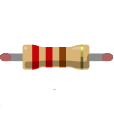

<!-- Latest compiled and minified CSS & JS -->
<link rel="stylesheet" media="screen" href="https://netdna.bootstrapcdn.com/bootstrap/3.2.0/css/bootstrap.min.css">

# Lecture 1: Let There Be Lights

## Plan of Action

 - Origin and History of Arduino
 - Getting Acquainted with the IDE
 - "Hello World" sketch
 - Traffic Lights

## Development of the Arduino

Born in an Italian design school, the Arduino was always going to be beatuiful. The distinctive microcontroller has won admirers all over the world, not just for its good looks but in particular for its ease of programming. While the company name and brand are protected copyrights the hardware design and programming software are all open source, meaning that anyone with sufficient knowledge can adapt and modify either of these to their hearts content. Since 2009? the Uno and a wide variety clones/copycats/officailly supported derivatives have found their way into the hands of engineers and hobbyists alike, which has contributed to the recent explosion in the maker movement and internet-of-things devices.

### Arduino Philosophy
Much of the Arduino's success is attributable to the open source nature of the project. It is possible to modify both the source code of the Arduino software as well as build your own Arduino in fact it's technically possible to build an imitation Arduino for under €5 worth of parts. This open philosophy has led to a huge community of users, hackers and makers springing up and supporting the platform, and it is arguably this community that is that Arduino's greatest asset.

## The Arduino IDE

An IDE, or __i__ntegrated __d__evelopment __e__nvironment, is used to write human readable software, compile it into machine readable code and produce illegible debug messages that will have you tearing your hair out in no time. The Arduino IDE is based on Processing, an open source project developed by ?, and is currently in version 1.6. 
The icons on the top of the editor perform the following functions:

**Verify** and **Upload**: Verify simply checks that the code is syntactically correct and suitable for uploading. The upload button verifies the code and then uploads it to the connected board.

**New, Open** and **Save** as the the names imply are for creating new sketches, opening existing sketches and saving the current sketch. 

On the top right of the editor is the **Open Serial Monitor** button. It allows you to send and recieve serial data between your computer and the Arduino.

## Anatomy of a Sketch

A program in Arduino is referred to as a __sketch__, which is a nod to its design origins. Sketches have the filetype `.ino`, as in ardu__ino__.  

As we progress we'll develop more and more sophisticated programs, but let's start with the most basic "Hello World" sketch, _blink_, which simply turns on and off the on-baord LED.

There are two sections, or blocks, of code that every sketch has to have, the `setup()` and the `loop()`

<code data-gist-id="2586d6da5e223bfbec40" data-gist-file="blink.ino" data-gist-line="3-8" data-gist-hide-footer="true"></code>

The loop function will just execute over and over again. In our example we are two different messages, or signals, to our LED. First we set it to be on (HIGH) and then off (LOW).

<code data-gist-id="2586d6da5e223bfbec40" data-gist-file="blink.ino" data-gist-line="10-20" data-gist-hide-footer="true"></code>

## Hello Ardunio World

This very basic bit of code gives us a good idea of how to structure an Arduino sketch, however, even this basic code has it's limitations. 

Let's say that we now want to move our LED from pin 13 to pin 12 - how many changes will this require in our code? We have to change the `pinMode` function and two `digitalWrite()` functions. I we had hard coded in pin 13 like this hundreds, or even thousands of times, then maintaing our code would quickly become a nightmare. A better approach in situations like this is to use a __variable__. A varaible acts like a placeholder for some type of information. Imagine you have a variable called `bankBalance`, depending on how often you get paid, or what you've bought recently, the __value__ of this variable will change, or vary, hence the name variable. From the perspective of the Arduino, or any computer for that matter, it sees the world only in binary digits, 1s and 0s, which can be used to represent anything the programmer wants. For this reason many programming langagues allow you to tell the computer what  __type__ of data, or varible, you wish to use. We'll cover data types in greater detail but for now all we need to know is that an `int` or integer is capable of storing roughly &plusmn;32,000 whole numbers. Since Arduino pins only go from 0 - 13 this will do fine.

<code data-gist-id="2586d6da5e223bfbec40" data-gist-file="blink2.ino"  data-gist-hide-footer="true"></code>
 

## Morse Code

As well as sending information digitally, via ones and zeros, it's also possible to send information light or sound. Systems such as Morse code encode information as either long or short pulses. Does this old ring tone sound familiar to you? 
    
</img>
<audio controls style="display:block; margin:auto">
  <source src="MorseSMS/sms.mp3" type="audio/mpeg">
  <source src="MorseSMS/sms.ogg" type="audio/ogg">
Your browser does not support the audio element.
</audio>

What we'll do now is have our LED recreate this pattern (3 short, pause, 2 long, pause, 3 short, pause) using the functions we've learned so far.

## Creating Functions

int LED = 13;

### Pinteresting

Voltage and current from an Arduino pin

## Resistors

</img>
</img>

### Ohm's Law

## Traffic Lights

<object data="img/trafficLights_plus.svg" type="image/svg+xml"></object>
### Code
<code data-gist-id="25f0bfed4db45384c3f6"></code>
<a href="https://gist.github.com/domhnallohanlon/25f0bfed4db45384c3f6/download" class="text-success pull-right">Download Code</a> 

### Video

### Stretch Goal
 - Initialise the LEDs using an array
 - Toggle lights based on keyboard input

## Where to?

<a href="https://domhnallohanlon.github.io" class="btn btn-primary"> Domhnall's Projects</a>  <a href="https://domhnallohanlon.github.io/arduinonotes" class="btn btn-success"> Arduino Resources</a>

