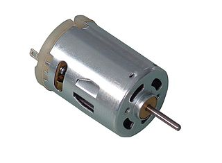
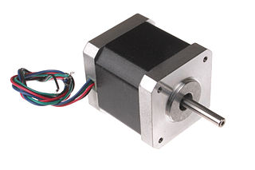
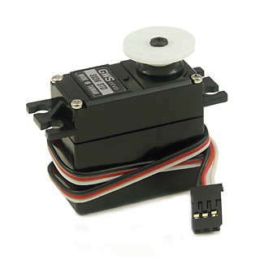
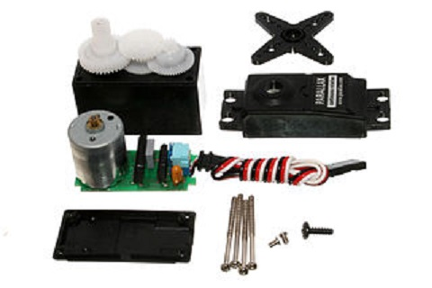

# Working with Motors

Adding a motor to a circuit is, from a design perspective, similar adding an inductor. This is becasue a typical DC motor consists of an electromagnetic coil surrounded by permanent magnets. When current flows through the coil a magnetic force is induced around it an it pushes back against the magnetic field of the surrounding magnets.

## DC Motors

The simplest type of motor you're likely to come across is a DC Motor

 

There are quite a few different parts in even the cheapest motor, but for the sake of simplicity we can consider just the most important parts.

###Rotor

The "inside bit" that rotates is called the rotor. This tpyically consists of a copper coil that functions as an electo-magnet.

###Stator

Surrounding the rotor is the "outside bit", or that stator, which is a stationary component. This consists of the case of the motor and more magnets, which can be either permanent or electro-magnets. 

## Steppers

At the other end of the motor spectrum are stepper motors. These are designed for applications that require higher levels of precision. As a rule of thumb, more expensive steppers will be capable of higher and higher levels of precision and higher loads. 

## Servos
 
A servo motor adds a small gearbox and a [potentiometer](#!parts.md#Potentiometer) to the motor which allows for finer control over its rotational position. In many servos, especially those aimed at hobbyists, the servo is limited to less then 360 degrees of rotation. It is possible, however, to purchase continuous rotation servos. Like a basic DC motor as servo has inputs, generally red and black,  for Voltage and Ground but it also has a data input, typically yellow or orange, which allows the user to control its angular position. 

  

### Servo Library

Arduino comes with libraries for extending its functionality, and making it easier to connect to a variety of standard components.   

<code data-gist-id="e9585bba4648dd463677"></code>

<a href="https://gist.github.com/domhnallohanlon/e9585bba4648dd463677/download" class="text-success pull-right">Download Code</a> 

The code above calls for the servo to be attached to pin 9. A schematic of the circuit is included below [click to view larger image]

## Where to?
<a href="mdwiki.html#!hbridge.md" class="btn btn-primary"> Next Section</a>  <a href="https://domhnallohanlon.github.io/arduinonotes" class="btn btn-success"> Arduino Resources</a>