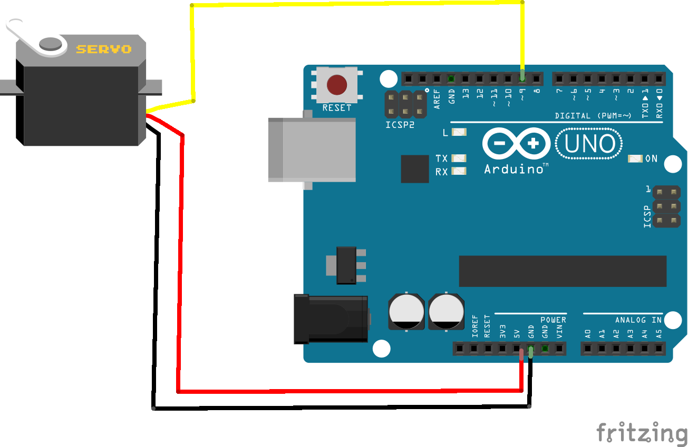
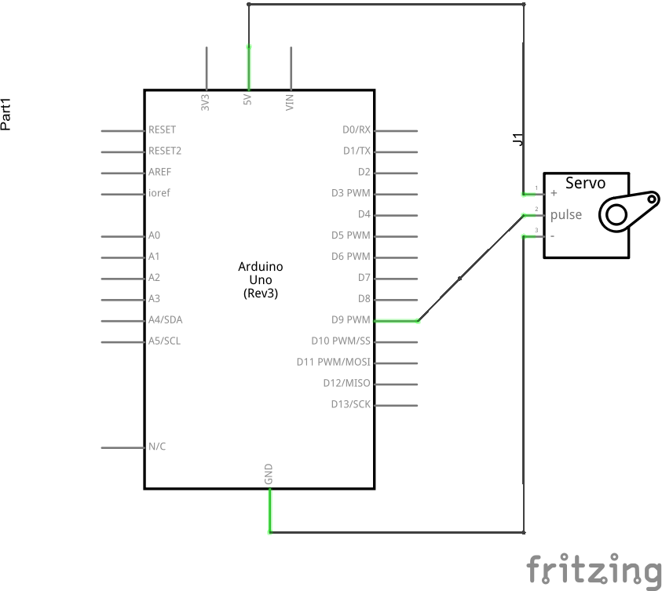

# Working with Motors

Adding a motor to a circuit is, from a design perspective, similar adding an inductor. This is becasue a typical DC motor consists of an electromagnetic coil surrounded by permanent magnets. When current flows through the coil a magnetic force is induced around it an it pushes back against the magnetic field of the surrounding magnets.

## DC Motors

###Rotor

###Stator

##Servo Library

A servo motor adds a small gearbox and a [potentiometer](#!parts.md#Potentiometer) to the motor which allows for finer control over its rotational position. In many servos, especially those aimed at hobbyists, the servo is limited to less then 360 degrees of rotation. It is possible, however, to purchase continuous rotation servos. Like a basic DC motor as servo has inputs, generally red and black,  for Voltage and Ground but it also has a data input, typically yellow or orange, which allows the user to control its angular position. 

<code data-gist-id="e9585bba4648dd463677"></code>

<a href="https://gist.github.com/domhnallohanlon/e9585bba4648dd463677/download" class="text-success pull-right">Download Code</a> 

The code above calls for the servo to be attached to pin 9. A schematic of the circuit is included below [click to view larger image]

## Steppers

## Where to?
<a href="mdwiki.html#!hbridge.md" class="btn btn-primary"> Next Section</a>  <a href="https://domhnallohanlon.github.io/arduinonotes" class="btn btn-success"> Arduino Resources</a>