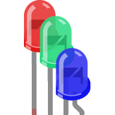
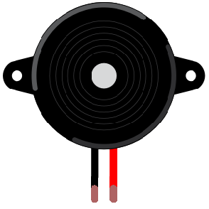
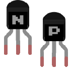

# Electronic Parts

A quick overview of some parts that you will typically find in a beginners electronics kit. 

## Capacitor

## Diode

See Also:
[LED](#Light_Emitting_Diodes)

## Inductor

## Light Dependent Resistor

## Light Emitting Diode

## Microphone

## Motors

###DC Motor

### Servo

### Stepper

## Potentiometer
Also known as a variable resistors, a potentiometer allows you to vary the resistance. 

## Resistors
Typically axial but also radial.
Coloured bands.

See also: 
[LDR](#Light_Dependent_Resistors)
[Potentiometer](#Potentiometer)
[Thermistor](#Thermistor)
[Variable Resistor](#Potentiometer)

##Speaker

## Switches

### Button Switch

### Reed Switch

### Relay

### Slide Switch

### Solenoid

###Tilt Switch

## Speaker

## Thermistor

##Transistor
