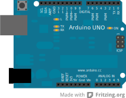

# Lecture 2: Sounds Like...

## Plan of Action

 - Recap
 - Reading Sensor Values
 - Mapping Data
 - Making Music

## Recap

## digitalRead()

## map()

## Notes

using the `tone` function.

## Theremin

Use an LDR to modulate a tune

## Where to?

<a href="mdwiki.html#!transistors.md" class="btn btn-primary"> Next Section</a>  <a href="https://domhnallohanlon.github.io/arduinonotes" class="btn btn-success"> Arduino Resources</a>