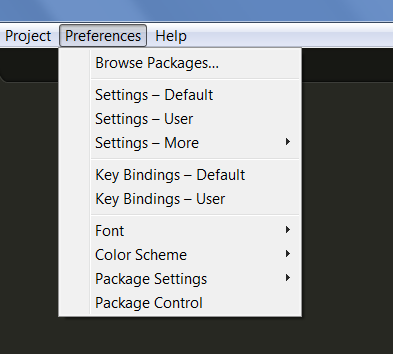
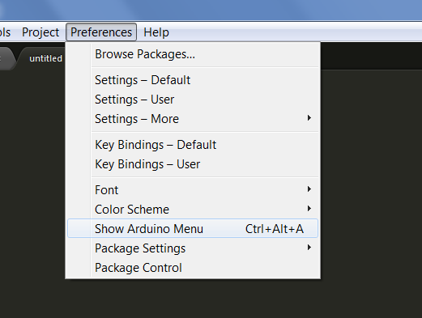
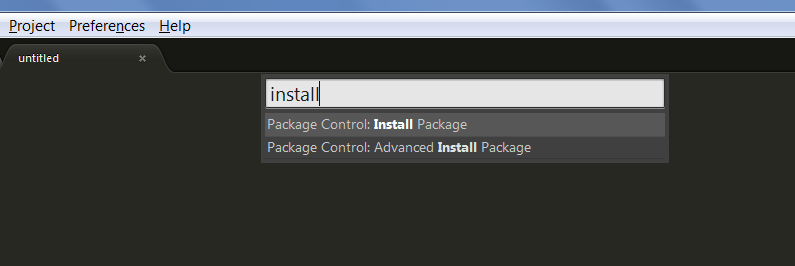
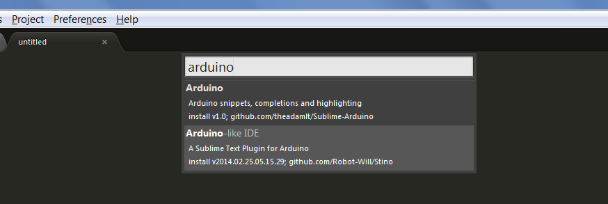
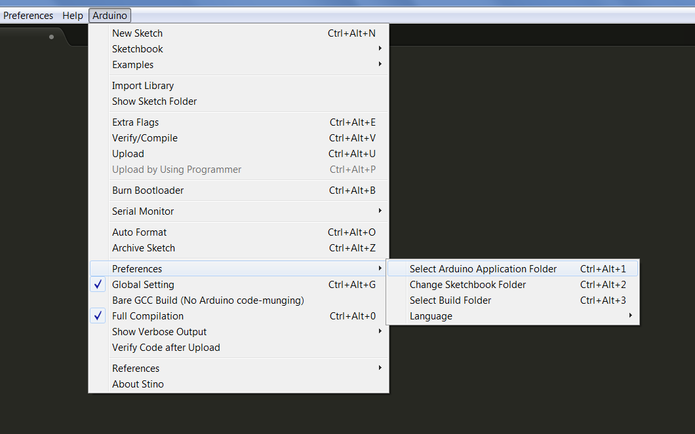
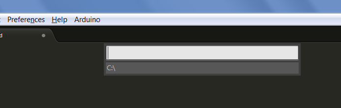
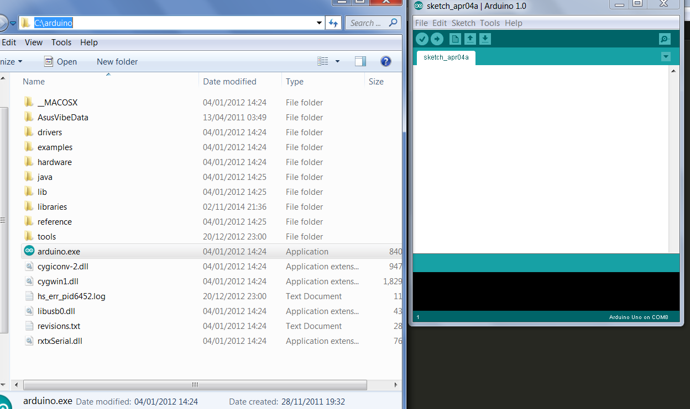
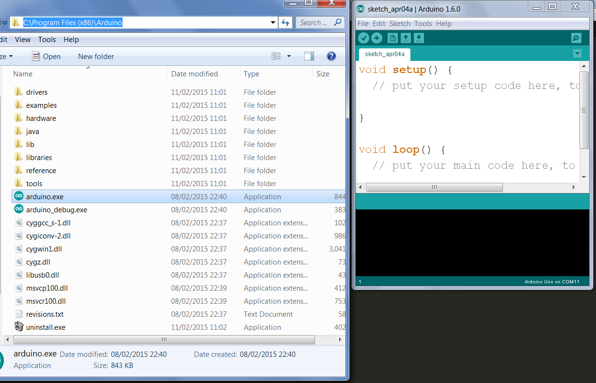

#Sublime Text + Arduino = Stino

It's no secret that I'm a huge fan of the Sublime Text editor. The number of features and level of customisation that it offers developers are incredible, and (at the time of writing at least) with a bit of practice it's a breeze to write Arduino code compared to the native Arduino IDE. As of version 1.6.3, there are nice additions, especially some much needed syntax highlighting, but for the moment Arduino's forte is hardware rather than software. This is where <a href="http://robot-will.github.io/Stino/" target="_blank">Robot Will</a> comes in. His Arduino plugin for Sublime Text allows you to write, upload, and debug sketches from the comfort of Sublime. 

## Getting Started

Once you've installed Stino you'll see a new menu item in *Preferences* called *Show Arduino Menu*

### Package Control
The quickest way to install Stino is with Will Bond's <a href="http://packagecontrol.io"target="_blank"> Package Control.</a> If you have this installed already the proceed to the next step - otherwise follow the link and install package control for your version of Sublime Text. 

### Install Package

Open the palette by clicking <kbd>Ctrl</kbd> + <kbd>Shift</kbd> + <kbd>P</kbd> on Windows or by pressing <kbd>Cmd</kbd> + <kbd>Shift</kbd> + <kbd>P</kbd> on a Mac and choose *Package Control: Install Package*

Start typing "Arduino" and you want to select the option that says *Arduino-like IDE*. You can see in the description that it's developed by "Robot Will" and the package name is "stino".

## Using Stino

Depending on your particular setup you may need to restart Sublime once or twice. The best way to test whether installation has been successful is by opening a `.ino` file. You should now see the new *Arduino* menu item to the right of *Help*

This new menu item should give you access to all the features of the Arduino IDE. If you don't have Arduino installed to the default location then Stino may not be able to see your examples and sketchbook. If you have installed Arduino to somewhere other than the default location just choose the *Select Arduino Folder* option and type the path to the directory where you have installed Arduino.

