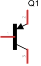
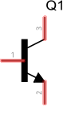

# Transisitors

## Electric Switches

A transistor functions like an electronically operated switch. The speed at which it can operate is dictated not by the swiftness of the operator but by the velocity of electricity traveling through a circuit. This means that an average transistor can vary from on to off, not just tens of times per second but hundreds or even thousands of times per second. It is this binary nature (either on or off) that makes them perfect for representing the world digitally. 

Transistors are made from semi-conducting materials and can be configured as NPN or PNP, and this construction untimately effects the way that they are wired in your circuit.

## PNP

 

## NPN

 
## Where to?

<a href="mdwiki.html#!motors.md" class="btn btn-primary"> Next Section</a>  <a href="https://domhnallohanlon.github.io/arduinonotes" class="btn btn-success"> Arduino Resources</a>